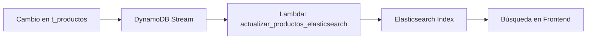

# 🔍 Elasticsearch en Arquitectura Multi-Tenant

## ¿Qué es Elasticsearch?

**Elasticsearch** es un motor de búsqueda y análisis distribuido, construido sobre Apache Lucene. En nuestra arquitectura serverless, actúa como el motor de búsqueda principal para productos, permitiendo:

- 🔎 **Búsqueda de texto completo** con relevancia
- 🚀 **Autocompletado en tiempo real**
- 📊 **Análisis y agregaciones** de datos
- 🌐 **Escalabilidad horizontal** automática

---

## 🏢 Implementación Multi-Tenant

### Estrategia de Índices Separados

En nuestra arquitectura, cada tenant tiene su propio índice de Elasticsearch:

```json
{
  "índices": {
    "productos-tenant-123": "Productos de la empresa 123",
    "productos-tenant-456": "Productos de la empresa 456",
    "productos-tenant-789": "Productos de la empresa 789"
  }
}
```

### Ventajas del Aislamiento por Índices:

- 🔒 **Seguridad**: Imposible acceso cross-tenant
- ⚡ **Performance**: Búsquedas optimizadas por tenant
- 📈 **Escalabilidad**: Índices independientes
- 🛡️ **Compliance**: Aislamiento de datos regulatorio

---

## 🔄 Integración con DynamoDB Streams

### Flujo de Ingesta en Tiempo Real



### Código de Ingesta (Lambda)

```python
import json
import boto3
from elasticsearch import Elasticsearch

def lambda_handler(event, context):
    """
    Procesa cambios de DynamoDB Streams y actualiza Elasticsearch
    """
    es_client = Elasticsearch([
        {'host': 'search-tienda-electronicos.us-east-1.es.amazonaws.com', 'port': 443}
    ])
    
    for record in event['Records']:
        # Extraer información del stream
        event_name = record['eventName']  # INSERT, MODIFY, REMOVE
        
        if event_name in ['INSERT', 'MODIFY']:
            # Producto nuevo o actualizado
            dynamodb_record = record['dynamodb']['NewImage']
            
            # Extraer tenant_id de la PK
            pk = dynamodb_record['PK']['S']  # "tenant_123"
            tenant_id = pk
            
            # Crear documento para Elasticsearch
            doc = {
                'codigo': dynamodb_record['codigo']['S'],
                'nombre': dynamodb_record['nombre']['S'],
                'descripcion': dynamodb_record['descripcion']['S'],
                'precio': float(dynamodb_record['precio']['N']),
                'categoria': dynamodb_record['categoria']['S'],
                'stock': int(dynamodb_record['stock']['N']),
                'activo': dynamodb_record.get('activo', {'BOOL': True})['BOOL'],
                'tags': dynamodb_record.get('tags', {'L': []})['L'],
                'updated_at': dynamodb_record['updated_at']['S']
            }
            
            # Índice específico del tenant
            index_name = f"productos-{tenant_id}"
            
            # Indexar en Elasticsearch
            es_client.index(
                index=index_name,
                id=doc['codigo'],
                body=doc
            )
            
        elif event_name == 'REMOVE':
            # Producto eliminado
            old_record = record['dynamodb']['OldImage']
            pk = old_record['PK']['S']
            tenant_id = pk
            codigo = old_record['codigo']['S']
            
            # Eliminar de Elasticsearch
            index_name = f"productos-{tenant_id}"
            es_client.delete(
                index=index_name,
                id=codigo,
                ignore=[404]  # Ignorar si ya no existe
            )
    
    return {'statusCode': 200}
```

---

## 🔍 Casos de Uso de Búsqueda

### 1. Búsqueda de Texto Completo

```javascript
// Frontend: Búsqueda de productos
const searchProducts = async (query, tenantId) => {
  const response = await fetch('/api/productos/buscar', {
    method: 'POST',
    headers: {
      'Authorization': `Bearer ${token}`,
      'Content-Type': 'application/json'
    },
    body: JSON.stringify({
      query: query,
      size: 20
    })
  });
  
  return response.json();
};

// Backend: Lambda buscarProducto.js
const searchInElasticsearch = async (query, tenantId) => {
  const searchParams = {
    index: `productos-${tenantId}`,
    body: {
      query: {
        multi_match: {
          query: query,
          fields: ['nombre^2', 'descripcion', 'tags'],
          fuzziness: 'AUTO'
        }
      },
      highlight: {
        fields: {
          nombre: {},
          descripcion: {}
        }
      },
      sort: [
        '_score',
        { precio: { order: 'asc' } }
      ]
    }
  };
  
  return await esClient.search(searchParams);
};
```

### 2. Autocompletado

```javascript
// Sugerencias mientras el usuario escribe
const autoComplete = async (prefix, tenantId) => {
  const response = await esClient.search({
    index: `productos-${tenantId}`,
    body: {
      suggest: {
        product_suggest: {
          prefix: prefix,
          completion: {
            field: 'suggest',
            size: 10
          }
        }
      }
    }
  });
  
  return response.body.suggest.product_suggest[0].options;
};
```

### 3. Filtros Avanzados

```javascript
// Búsqueda con filtros múltiples
const advancedSearch = async (params, tenantId) => {
  const { query, categoria, precioMin, precioMax, enStock } = params;
  
  const searchBody = {
    query: {
      bool: {
        must: [
          {
            multi_match: {
              query: query,
              fields: ['nombre', 'descripcion']
            }
          }
        ],
        filter: []
      }
    }
  };
  
  // Filtro por categoría
  if (categoria) {
    searchBody.query.bool.filter.push({
      term: { categoria: categoria }
    });
  }
  
  // Filtro por rango de precio
  if (precioMin || precioMax) {
    const priceFilter = { range: { precio: {} } };
    if (precioMin) priceFilter.range.precio.gte = precioMin;
    if (precioMax) priceFilter.range.precio.lte = precioMax;
    searchBody.query.bool.filter.push(priceFilter);
  }
  
  // Filtro por stock disponible
  if (enStock) {
    searchBody.query.bool.filter.push({
      range: { stock: { gt: 0 } }
    });
  }
  
  return await esClient.search({
    index: `productos-${tenantId}`,
    body: searchBody
  });
};
```

---

## 📊 Análisis y Métricas

### Agregaciones por Tenant

```javascript
// Análisis de productos más buscados
const getSearchAnalytics = async (tenantId) => {
  return await esClient.search({
    index: `productos-${tenantId}`,
    body: {
      size: 0,
      aggs: {
        categorias_populares: {
          terms: {
            field: 'categoria',
            size: 10
          },
          aggs: {
            precio_promedio: {
              avg: { field: 'precio' }
            }
          }
        },
        rango_precios: {
          histogram: {
            field: 'precio',
            interval: 100
          }
        }
      }
    }
  });
};
```

---

## 🚀 Configuración en AWS

### 1. Amazon Elasticsearch Service

```yaml
# En serverless.yml de lambda-ingesta
resources:
  Resources:
    ElasticsearchDomain:
      Type: AWS::Elasticsearch::Domain
      Properties:
        DomainName: tienda-electronicos-${self:custom.stage}
        ElasticsearchVersion: 7.10
        ClusterConfig:
          InstanceType: t3.small.elasticsearch
          InstanceCount: 1
        EBSOptions:
          EBSEnabled: true
          VolumeType: gp2
          VolumeSize: 20
        AccessPolicies:
          Version: '2012-10-17'
          Statement:
            - Effect: Allow
              Principal:
                AWS: !Sub "arn:aws:iam::${AWS::AccountId}:role/LabRole"
              Action: 'es:*'
              Resource: !Sub "arn:aws:es:${AWS::Region}:${AWS::AccountId}:domain/tienda-electronicos-${self:custom.stage}/*"
```

### 2. Configuración de Mapping

```javascript
// Crear mapping optimizado para productos
const createProductMapping = async (tenantId) => {
  const indexName = `productos-${tenantId}`;
  
  const mapping = {
    mappings: {
      properties: {
        codigo: { type: 'keyword' },
        nombre: { 
          type: 'text',
          analyzer: 'standard',
          fields: {
            keyword: { type: 'keyword' }
          }
        },
        descripcion: { type: 'text' },
        precio: { type: 'float' },
        categoria: { type: 'keyword' },
        stock: { type: 'integer' },
        activo: { type: 'boolean' },
        tags: { type: 'keyword' },
        suggest: {
          type: 'completion',
          analyzer: 'simple'
        },
        updated_at: { type: 'date' }
      }
    },
    settings: {
      number_of_shards: 1,
      number_of_replicas: 0
    }
  };
  
  await esClient.indices.create({
    index: indexName,
    body: mapping
  });
};
```

---

## 🔧 Mejores Prácticas

### 1. Gestión de Índices
- ✅ **Crear índices automáticamente** cuando se registra un nuevo tenant
- ✅ **Usar aliases** para facilitar el mantenimiento
- ✅ **Implementar rotation** de índices para logs
- ✅ **Monitorear uso de storage** por tenant

### 2. Performance
- ✅ **Limitar resultados** por consulta (max 100)
- ✅ **Usar pagination** para resultados grandes
- ✅ **Implementar caching** de búsquedas frecuentes
- ✅ **Optimizar mappings** según casos de uso

### 3. Seguridad
- ✅ **Validar tenant_id** en todas las búsquedas
- ✅ **Usar IAM roles** específicos por servicio
- ✅ **Implementar rate limiting** por tenant
- ✅ **Auditar accesos** a índices sensibles

### 4. Monitoreo
```javascript
// Métricas de uso por tenant
const getTenantMetrics = async (tenantId) => {
  return await esClient.cat.indices({
    index: `productos-${tenantId}`,
    format: 'json',
    bytes: 'b'
  });
};
```

---

## 🎯 Beneficios en la Arquitectura

1. **🔍 Búsqueda Inteligente**: Resultados relevantes con scoring automático
2. **⚡ Performance**: Respuestas en milisegundos para miles de productos  
3. **🏢 Multi-Tenancy**: Aislamiento completo de datos por empresa
4. **📊 Analytics**: Insights sobre patrones de búsqueda y productos
5. **🔄 Tiempo Real**: Sincronización automática con DynamoDB
6. **💰 Costo-Efectivo**: Solo paga por lo que usa en AWS

Elasticsearch transforma una simple lista de productos en una experiencia de búsqueda moderna y potente, manteniendo el aislamiento multi-tenant requerido para aplicaciones empresariales.

---

## 🔒 Seguridad y Autorización en Endpoints

Todos los endpoints de nuestra arquitectura están protegidos mediante **JSON Web Tokens (JWT)**. En cada función Lambda (por ejemplo, `buscarProducto.js`, `crearProducto.js`, etc.) se invoca una utilidad `validateJWT(event)` que:
  - Verifica la firma y validez del token.
  - Extrae el `usuario_id` y `tenant_id` del usuario autenticado.
  - Devuelve un error HTTP 403 si el token no es válido o ha expirado.

Además, cada handler comprueba que el `tenant_id` extraído del token coincida con los recursos solicitados. Si un usuario intenta acceder o modificar datos de otro tenant, la función retornará un **403 Forbidden**.

Este mecanismo garantiza que:
  - Solo usuarios autenticados puedan invocar los endpoints.
  - No exista acceso cross-tenant.

---

## 👑 Superadmin y Creación de Tenants

Para gestionar múltiples tenants y mantener un control centralizado, disponemos de un **rol superadmin** con los siguientes atributos:

- **Rol**: `superadmin`
- **Alcance**: Puede ver y modificar la configuración de todos los tenants.
- **Autorización**: Acceso exclusivo a endpoints de administración, protegidos con JWT y verificación de rol.

### Flujo de Creación de Tenant

1. **Login como Superadmin**: Acceder al endpoint `POST /usuarios/login` con credenciales de superadmin.
2. **Invocar endpoint de creación de tenant**: `POST /admin/tenants/crear` (solo superadmin).
   - Request body:
     ```json
     {
       "nombre_empresa": "Nombre de la Empresa",
       "plan": "free|pro|enterprise"
     }
     ```
3. **Generar tenant_id**: Se crea un UUID único para el nuevo tenant.
4. **Almacenar metadatos** en la tabla `Tenants` (DynamoDB):
   - PK = `TENANT#<tenant_id>`, SK = `META`
   - Atributos: `nombre_empresa`, `plan`, `created_at`, `status`, etc.
5. **Provisionar recursos**:
   - Crear índice Elasticsearch: `productos-<tenant_id>` con el mapping configurado.
   - Inicializar configuraciones en AWS Parameter Store o Secrets Manager si es necesario.
6. **Asignar administrador del tenant**:
   - Opcionalmente, registrar un primer usuario con rol `admin` en ese tenant.

### Esquema de Endpoints de Administración

| Servicio        | Ruta                         | Método | Descripción                        |
|-----------------|------------------------------|--------|------------------------------------|
| Usuarios        | POST /admin/usuarios/crear   | POST   | Crea usuarios (superadmin/admin)   |
| Login           | POST /usuarios/login         | POST   | Autenticación                      |
| Tenants         | POST /admin/tenants/crear    | POST   | Crea un nuevo tenant               |
| Tenants         | GET  /admin/tenants          | GET    | Lista todos los tenants            |
| Tenants         | PATCH /admin/tenants/{id}    | PATCH  | Actualiza metadatos de un tenant   |
| Tenants         | DELETE /admin/tenants/{id}   | DELETE | Deshabilita un tenant              |

> **Nota:** Todos los endpoints en `/admin/*` requieren JWT válido con rol `superadmin` y retornan **403 Forbidden** si no cumple.
